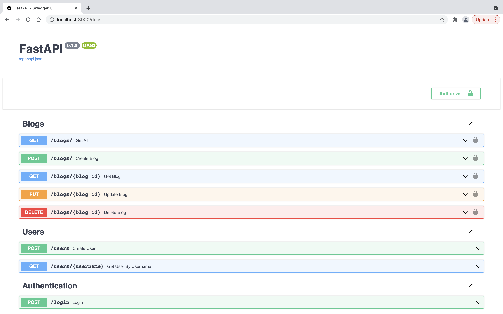

# blogs-app-fastapi
Simple Blogs app made using [FastAPI](https://github.com/tiangolo/fastapi)

## ScreenShot

<div>

</div>

## Web Routes

All routes are available on ``/docs`` or ``/redoc`` paths with Swagger or ReDoc.

## Features

- API Docs
- ORM using SQLAlchemy
- JWT Authentication
- Pydantic Schemas

## Quick Start

First, create a virtual env:

```bash
python3 -m venv env
```

Second activate the virtual env:

```bash
source env/bin/activate
```

Next, install requirements from requirements.txt:

```bash
pip3 install -r requirements.txt
```

For running the app in debug mode:

```bash
uvicorn blog.main:app --reload
```
